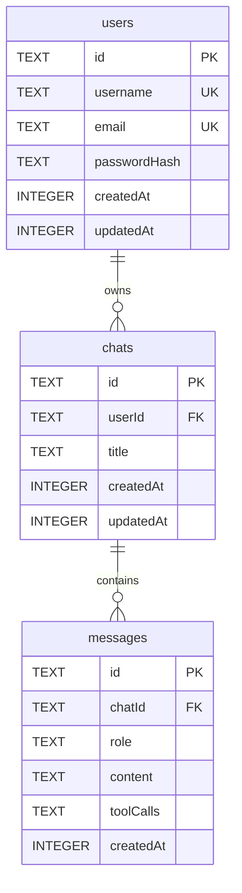

# Implementation Plan: Multi-User Authentication & Isolation

This plan details the architecture, design choices, database schema, and code execution steps needed to transform the WebCloud IDE from a single-tenant environment into a secure, multi-tenant cloud IDE.

---

## 1. Authentication Approaches & Strategy

To secure the IDE, we can choose from three primary authentication methodologies. We compare them below to select the optimal approach for this system.

| Authentication Method | Implementation Overview | Pros | Cons | Recommendation |
| :--- | :--- | :--- | :--- | :--- |
| **Option A: JWT (JSON Web Tokens)** | Handled in the Node/Express backend. Users register/login with their email and password. Server verifies credentials, signs a secure JWT, and returns it. | - Stateless and lightweight<br>- High performance (no session lookups)<br>- Fits beautifully with WebSockets (Socket.IO handshake) | - Token revocation requires blacklisting or short token lifetimes | **Recommended (Core)**: A highly standard, self-contained solution perfectly suited to our Express backend. |
| **Option B: OAuth 2.0 (GitHub / Google)** | Users log in via Github or Google accounts. The backend handles redirects, exchanges code for profiles, and links them to database user records. | - Extremely convenient for developers<br>- No passwords to manage or hash<br>- Higher security out-of-the-box | - Complex local development setup (requires client secrets and redirect configurations) | **Highly Recommended (Secondary)**: Perfect extension for developer tools; can sit alongside JWT. |
| **Option C: Server-Side Sessions** | Express handles session cookies matching a stateful session ID stored in a backend SQLite `sessions` table. | - Full real-time control over session revocation | - Requires a database read on every HTTP / Socket call (stateful) | **Alternative**: More complex to scale and implement securely with WebSockets. |

### Proposed Approach: JWT Authenticated Sessions with Optional GitHub OAuth Extension
We will implement **Option A (JWT)** as our foundation, with an architecture designed to easily permit **Option B (GitHub OAuth)**.
* **Token Storage**: On the client side, we will store the JWT securely in `localStorage` or via secure `HttpOnly` cookies.
* **Request Lifecycle**: The client includes the token in the `Authorization: Bearer <token>` header for REST calls and via the `auth: { token }` payload during Socket.IO connections.

---

## 2. Database Design & Schema Matching for Each User

Currently, our database (`chats.db`) is single-user. We will restructure the SQLite schema to introduce a `users` table and establish **Cascading Relational Scopes**.

### Relational Schema (Mermaid Entity Relationship Diagram)



### Table Definitions (DDL)

We will modify `server/db.js` to create the `users` table and establish proper foreign keys and indices:

```sql
-- Enable SQLite Foreign Key Enforcement
PRAGMA foreign_keys = ON;

-- 1. Users Table
CREATE TABLE IF NOT EXISTS users (
    id TEXT PRIMARY KEY,
    username TEXT UNIQUE NOT NULL,
    email TEXT UNIQUE NOT NULL,
    passwordHash TEXT NOT NULL,
    createdAt INTEGER NOT NULL,
    updatedAt INTEGER NOT NULL
);

-- 2. Scoped Chats Table (with userId foreign key)
CREATE TABLE IF NOT EXISTS chats (
    id TEXT PRIMARY KEY,
    userId TEXT NOT NULL,
    title TEXT NOT NULL,
    createdAt INTEGER NOT NULL,
    updatedAt INTEGER NOT NULL,
    FOREIGN KEY (userId) REFERENCES users (id) ON DELETE CASCADE
);

-- Indexing for fast queries by userId
CREATE INDEX IF NOT EXISTS idx_chats_userId ON chats(userId);

-- 3. Messages Table (remains scoped to chatId)
CREATE TABLE IF NOT EXISTS messages (
    id TEXT PRIMARY KEY,
    chatId TEXT NOT NULL,
    role TEXT NOT NULL,
    content TEXT NOT NULL,
    toolCalls TEXT, -- Serialized JSON array of tool states
    createdAt INTEGER NOT NULL,
    FOREIGN KEY (chatId) REFERENCES chats (id) ON DELETE CASCADE
);

-- Indexing for fast messages retrieval by chatId
CREATE INDEX IF NOT EXISTS idx_messages_chatId ON messages(chatId);
```

---

## 3. How the Database & Environments are Scoped to Each User

To support multiple simultaneous users safely, we must separate data and processes.

### A. Scoping Database Queries
All CRUD endpoints in the server must check the authenticated user's ID (`req.user.id`). This prevents IDOR (Insecure Direct Object Reference) attacks:

* **Get Chats**: Query specifically retrieves chats belonging to the user:
  ```sql
  SELECT id, title, createdAt, updatedAt FROM chats WHERE userId = ? ORDER BY updatedAt DESC
  ```
* **Verify Ownership**: For all chat modifications, title updates, and deletion requests, we must first verify that `chats.userId === req.user.id`.

### B. Isolated Docker Workspace Containers
Our `server/containerManager.js` is already designed to run isolated environments via:
* **Container Name**: `ide_user_${userId}`
* **Volume Name**: `ide_vol_${userId}` (stores user-specific source code)

We will remove the hardcoded `'default'` string from backend controllers. When a user calls a file or workspace API, the server:
1. Validates the user's JWT.
2. Extracts the `userId`.
3. Calls `await ensureContainer(userId)`.
4. Executes the commands / reads the filesystem *strictly* inside `ide_user_${userId}`.

### C. Isolated Interactive Terminal (PTY) Sessions
Currently, there is a global `ptyProcess` in `server/index.js` which pipes input/output for all users to a single container shell. In a multi-user environment, we must instantiate one terminal instance per connected socket.

1. **Active Terminal Pool**: Build a terminal session manager (`server/terminalManager.js` or in-memory map):
   ```javascript
   const activeTerminals = new Map(); // userId -> ptyProcess
   ```
2. **Socket Authentication & Mapping**:
   When a user connects via Socket.IO:
   * Perform authorization check during connection handshake.
   * If authorized, retrieve their `userId`.
   * Check if a `ptyProcess` already exists for this `userId`. If not:
     * Spawn an interactive Docker shell tied *specifically* to that user's container:
       ```javascript
       const ptyProcess = pty.spawn('docker', ['exec', '-it', `ide_user_${userId}`, '/bin/bash'], { ... });
       ```
     * Route terminal input/output events solely to that socket connection.
3. **Cleanup Lifecycle**:
   When the WebSocket disconnects, wait 60 seconds (grace period) before shutting down and destroying the user's `ptyProcess` to conserve server CPU/Memory.

---

## 4. Proposed Execution & Code Changes

To implement this plan, we will conduct changes across both components.

### Proposed Changes: Backend (Server)

---

#### [MODIFY] [package.json](file:///d:/Projects/WebCloud%20IDE/server/package.json)
* **Action**: Add `jsonwebtoken` and `bcryptjs` for encryption and JWT operations.
* **Dependencies added**:
  ```json
  "bcryptjs": "^2.4.3",
  "jsonwebtoken": "^9.0.2"
  ```

#### [NEW] [auth.js](file:///d:/Projects/WebCloud%20IDE/server/auth.js)
* **Action**: Create authentication middleware to verify JWT and helper functions to sign tokens.
* **Key Functions**:
  * `hashPassword(password)`
  * `comparePassword(password, hash)`
  * `generateToken(user)`
  * `authenticateToken(req, res, next)` (Express route middleware)
  * `authenticateSocketToken(socket, next)` (Socket.IO handshake verification middleware)

#### [MODIFY] [db.js](file:///d:/Projects/WebCloud%20IDE/server/db.js)
* **Action**:
  * Upgrade table initialization to include the `users` table and update the `chats` schema with a `userId` foreign key.
  * Implement user creation and verification database helper methods: `createUser(username, email, password)`, `getUserByEmail(email)`.
  * Update chat methods to require `userId`: `getChats(userId)`, `createChat(userId, id, title)`, `getChat(userId, id)` (ensuring direct ownership validation).

#### [MODIFY] [index.js](file:///d:/Projects/WebCloud%20IDE/server/index.js)
* **Action**:
  * Create authentication endpoints: `POST /api/auth/register` and `POST /api/auth/login`.
  * Update `/files` and `/files/content` routes to use `authenticateToken` middleware and fetch resources inside `containerExec(req.user.id, ...)`.
  * Refactor Socket.IO logic to authenticate the client handshake using `authenticateSocketToken`.
  * Replace the single global `ptyProcess` with a pool of user-isolated terminal processes mapped to the socket's verified `userId`.

#### [MODIFY] [ai.js](file:///d:/Projects/WebCloud%20IDE/server/ai.js)
* **Action**: Secure the AI routes using the `authenticateToken` middleware, ensuring that requests to fetch/modify/create chats and messages are validated against `req.user.id`.

---

### Proposed Changes: Frontend (Client)

---

#### [NEW] [Login.jsx](file:///d:/Projects/WebCloud%20IDE/client/src/component/Login.jsx)
* **Action**: Create a stunning, premium glassmorphic authentication screen that allows users to sign up or sign in.
* **Design details**: Use deep indigo and deep slate gradient backgrounds, blur backdrops (`backdrop-filter: blur(10px)`), smooth text-input transitions, and subtle hover animations for credentials submission.

#### [MODIFY] [App.jsx](file:///d:/Projects/WebCloud%20IDE/client/src/App.jsx)
* **Action**:
  * Add authentication state tracking: `const [isAuthenticated, setIsAuthenticated] = useState(false);` and `const [token, setToken] = useState(localStorage.getItem('token'));`
  * If `isAuthenticated` is false, render the new modern `<Login onAuthSuccess={handleAuthSuccess} />` component.
  * Inject the JWT token into all fetch requests (`Authorization: Bearer <token>`).
  * Ensure Socket.IO is initialized *only* after auth success, passing the JWT token in the handshake.

---

## 5. Verification & Testing Plan

### Automated Verification
* **Password Hashing Test**: Validate that password entries are encrypted using bcrypt and match hashes.
* **Authentication Interceptors**: Trigger requests to `/files` or `/ai/chats` without a token and confirm the API returns a proper `401 Unauthorized` status.
* **IDOR Attack Simulation**: Attempt to request another user's chat ID (e.g. `GET /ai/chats/some-other-uuid`) using User A's token and verify the database returns `404 Not Found` or `403 Forbidden`.

### Manual Verification
1. Open the application. Verify the display is redirected to the premium Login / Register interface.
2. Sign up two separate accounts: User A (`alice@example.com`) and User B (`bob@example.com`).
3. Log in as Alice:
   * Create three AI chat sessions.
   * Open files inside the workspace and run `npm start` in the terminal.
4. Open an Incognito window and log in as Bob:
   * Confirm Bob has a completely blank chat list (no overlap with Alice).
   * Confirm Bob's workspace runs inside a separate container with its own terminal and file history, totally independent from Alice.
5. In Alice's window, verify that deleting a chat cascade-deletes Alice's messages safely in SQLite.

---

## 6. Open Questions & Future Enhancements

> [!IMPORTANT]
> 1. **Initial File Seeding**: When a user registers for the first time, what starter repository files should be loaded into their container workspace (`/home/user/workspace`)? Currently we copy from the `server/__user` directory. Should we keep this or allow users to link a Github repository during signup?
> 2. **Environment Session Limits**: Since running containers consume system RAM and CPU, should we put containers to sleep automatically when a user has been idle for more than 15 minutes?
